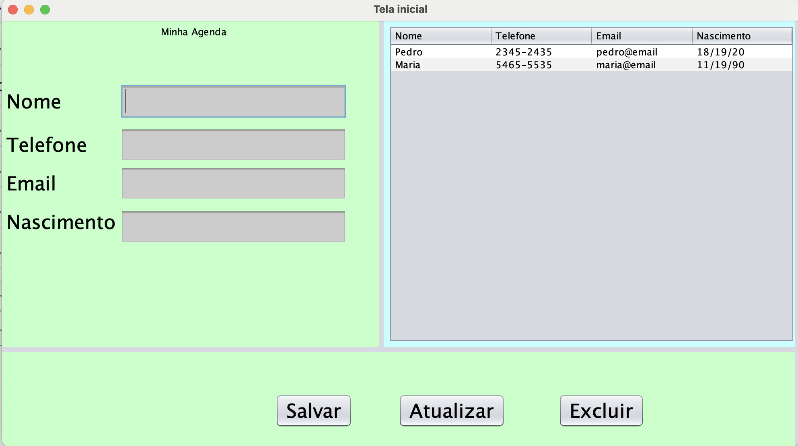
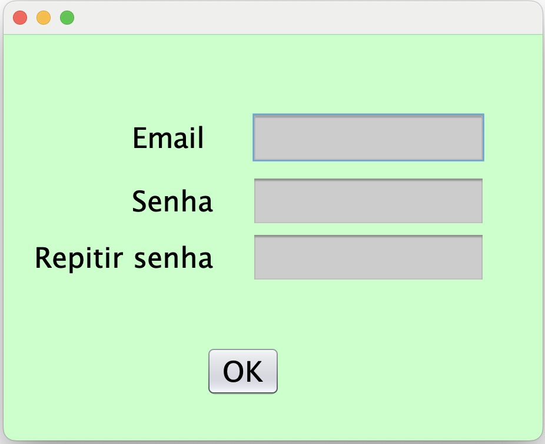
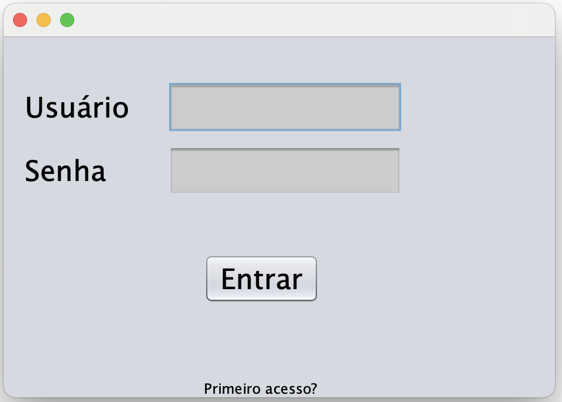

A IDE utilizada para construir o projeto foi o NETBEANS
# Aula 12 - Interfaces gráficas para o usuário (GUI) - Programação orientada a objetos

Nesta aula foram desensvolvidas trës telas utilizando o java SWING para construir interfaces. Esta aula introduz o conceito de Interfaces Gráficas de Usuário (GUI) em Java, explicando sua importância e como elas facilitam a interação do usuário com aplicações. Ela explora as diferentes opções para criar GUIs em Java, com ênfase na biblioteca Swing, abordando desde a criação básica de janelas (JFrame) até o uso de componentes como `JButton`, `JLabel`, `JTextField`, e `JTable`. A aula também trata da implementação de eventos e ações nos componentes, permitindo a modificação e recuperação de dados da interface, e do gerenciamento de frames na aplicação, incluindo como chamar, esconder ou encerrar uma janela.

# Tela de login desenvolvida

# Tela de login desenvolvida

# Tela de registrar usuário

# Aula 13 - Banco de dados com Java - Programação orientada a objetos

Esta aula foca na integração de Java com bancos de dados, utilizando o SQLite como exemplo. Ela cobre desde a configuração do ambiente de desenvolvimento no NetBeans, adicionando as dependências necessárias via Maven, até a implementação de operações CRUD (Create, Read, Update, Delete) em um banco de dados. A aula introduz o padrão DAO (Data Access Object) para organizar o código de acesso ao banco de dados, separando a lógica de negócios da lógica de persistência, e discute o uso de objetos como `Connection`, `PreparedStatement` e `ResultSet` para manipulação de dados de forma segura e eficiente.

